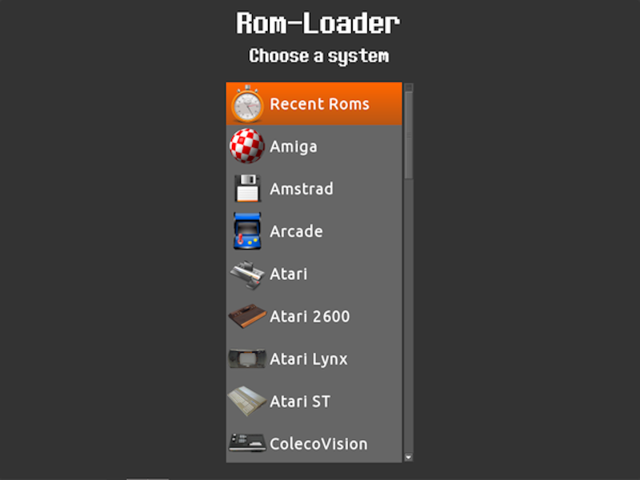
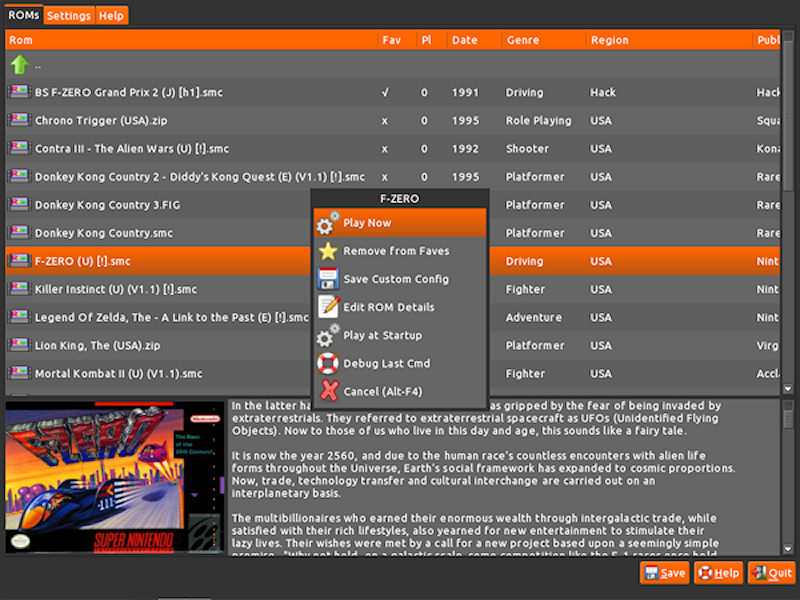
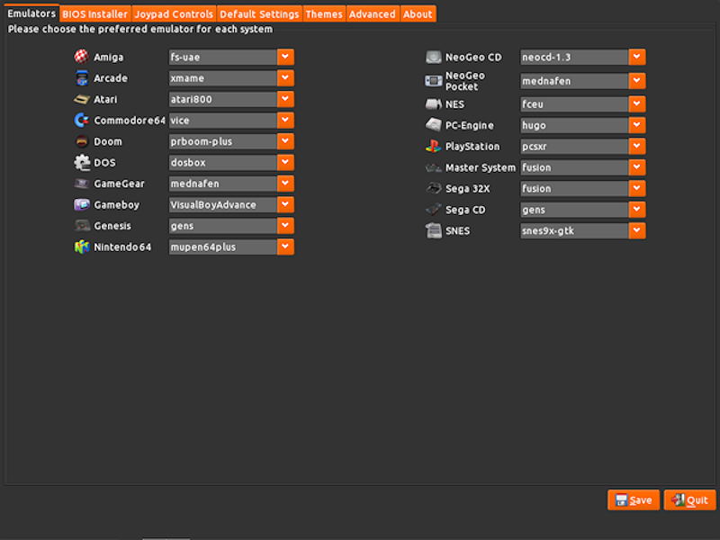
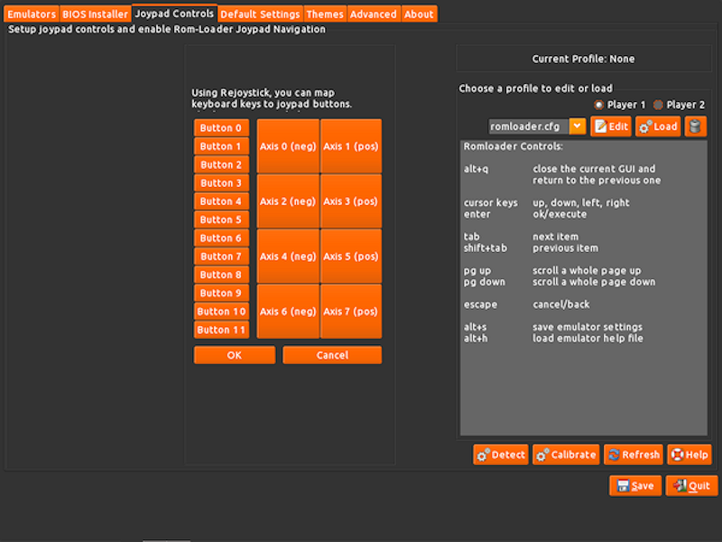
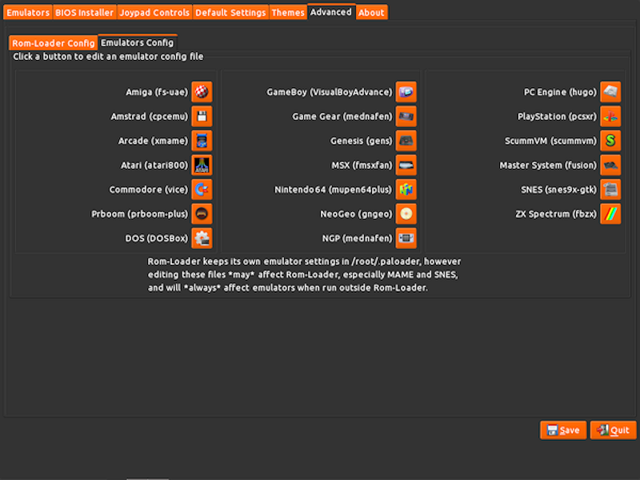

# Rom-loader

A [GtkDialog](https://github.com/01micko/gtkdialog/) based frontend GUI for multiple retro gaming emulators.

Supports the following systems:

_Amiga (500, 1000, 2000, CD32, CDTV), Apple (68k, 128k, 512k, SE, MacOS, Plus),
Atari (400, 400 XL, 800, 800XL, 130XE, 5200, Falcon, Lynx, ST, others), Amstrad
(CPC, Plus, VEB, others), Arcades (many), Colecovision, Commodore (64, 128,
VIC20, PET, others), Doom, GameBoys (GB, GBC, GBA), GameGear, Genesis/MegaDrive,
Intellivision, Master System, MS DOS, MSX, MSX2, N64, NDS, NeoGeo, NeoGeo Pocket,
NeoGeo CD, NES/Famicom, PC Engine/TurboGrafix, PC-FX, PlayStation, PSP, ScummVM,
SNES, Wonderswan, Virtual Boy, ZX Spectrum (16k, 48k, 128k, +2, +2A, +3) and
more!_



**Rom-Loader** is just a bunch of shell scripts. It should work on any architecture.

Made for [Puppy Linux](http://puppylinux.com). Thanks to [zigbert](https://github.com/zigbert) and many others...

## Requirements

### Dependencies

- [gtkdialog](https://github.com/01micko/gtkdialog/) >= 0.8.4
- [rejoystick](https://github.com/ssalenik/rejoystick) - Rejoystick allows you to map joystick buttons to keyboard keys\*\*
- [rejoystickCC](https://github.com/sc0ttj/rejoystickCC) - a simple GUI for configuring Rejoystick
- [JWM window manager](https://joewing.net/projects/jwm/) (optional - for fullscreen working "out of the box", see [Fullscreen setup](#fullscreen-setup))

\*\* So you can enable joypads even with emulators that don't support them :)

### Emulators

Emulators are required to actually play any games.

If installed, Rom-Loader can use any of the following emulators:

- [AdvMAME](https://www.advancemame.it/) - Multiple arcades systems
- [Atari800](https://atari800.github.io/) - Atari 8-bit and 5200
- [Atari++](http://www.xl-project.com/) - Atari 400, 800, 400XL, 800XL, 130XE, 5200
- [Basilisk](https://basilisk.cebix.net/) - Apple Mac
- [CPCEmu](http://www.cpc-emu.org/) - Amstrad CPC
- [Desmume](http://desmume.org) - Nintendo DS
- [Dega](https://segaretro.org/Dega) - SEGA Genesis/MegaDrive
- [Dgen](https://dgen.sourceforge.net/) - SEGA Genesis/MegaDrive
- [DOSBox](http://www.dosbox.com) - DOS
- [E-UAE](https://www.rcdrummond.net/uae/) - Atari systems
- [ePSXe](https://www.epsxe.com) - PlayStation (PSX)
- [FCEUX](http://www.fceux.com/web/home.html) - Nintendo Entertainment System (NES)
- [Frodo](https://frodo.cebix.net) - Commodore64
- [FS-UAE](https://fs-uae.net/) - Atari A500, A500+, A600, A1200, A1000, A3000 and A4000 models
- [Gens/GenGS](https://segaretro.org/Gens/GS) - SEGA Master System, Genesis/MegaDrive, 32X
- [GnGeo](https://github.com/linuxlinks/gngeo) - NeoGeo
- [GxMAME](http://gxmame.sourceforge.net/) - Multiple arcades systems
- [Hatari](https://hatari.tuxfamily.org/) - Atari ST
- [HuGo](https://www.emutopia.com/index.php/emulators/item/285-nec-pc-engine-turbografx/325-hu-go) - PC Engine
- [iNES](https://fms.komkon.org/iNES/) - Nintendo Entertainment System (NES)
- [Kega Fusion](https://www.carpeludum.com/kega-fusion/) - SEGA Master System, Game Gear, Genesis/Megadrive, SegaCD/MegaCD, 32X, others
- [Mupen64plus](https://mupen64plus.org/) - Nintendo N64
- [Mednafen](https://mednafen.github.io/) - Genesis, SNES, PSX, Gameboy Color and Advance, PC Engine, SEGA Saturn, others
- [M.A.M.E](https://www.mamedev.org/) - Multiple arcades systems
- [PCSXr](https://wiki.archlinux.org/index.php/PCSX-Reloaded) - PlayStation (PSX)
- [PCSX2](https://pcsx2.net/)- PlayStation2 (PS2)
- [NeoCD](http://pacifi3d.retrogames.com/neocdsdl/) - NeoGeo CD
- [Nestopia](http://nestopia.sourceforge.net/) - Nintendo Entertainment System (NES)
- [Osmose](https://segaretro.org/Osmose) - SEGA Master System
- [PPSSPP](https://www.ppsspp.org/) - Sony PSP
- [PrBoom Plus](http://prboom-plus.sourceforge.net/) - Doom, Doom 2, Hexen
- [ScummVM](https://www.scummvm.org) - Scumm engine and Sierra point and click games
- [SDLMAME](http://sdlmame.lngn.net) - Multiple arcades systems
- [Snes9x-GTK](http://murga-linux.com/puppy/viewtopic.php?p=695000) - Nintendo SNES
- [Speccy](https://fms.komkon.org/Speccy/) - Spectrum ZX
- [Stella](https://stella-emu.github.io/) - Atari 2600
- [VisualBoyAdvance](https://sourceforge.net/projects/vba/) - Gameboy Color (GBC) and Advance (GBA)
- [VBA-M](https://github.com/visualboyadvance-m/visualboyadvance-m) - Gameboy Color (GBC) and Advance (GBA)
- [VICE](http://vice-emu.sourceforge.net/) - Commodore 64 and many other Commodore systems
- [Yabause-GTK](https://yabause.org) - SEGA Saturn
- [ZiNc](http://emulation.gametechwiki.com/index.php/ZiNc) - Namco/Sony arcades systems
- [ZSNES](https://www.zsnes.com) - Ninteno SNES

## Releases

### Puppy Arcade 11

Rom-Loader (and all supported emulators) is included by default in [Puppy Arcade](http://murga-linux.com/puppy/viewtopic.php?t=92414), which can be downloaded here:

- [Puppy Arcade 11](https://archive.org/download/Puppy_Linux_Puppy_Arcade/slacko_arcade.iso) (retro gaming Linux, based on Puppy Linux "Slacko" 5.9)
- for compiling stuff in Puppy Arcade 11, download the [dev packages SFS file](https://archive.org/download/Puppy_Linux_Puppy_Arcade/devx_slacko_5.9.2.sfs) and mount it

Other versions:

- [Puppy Arcade at the Internet Archive](https://archive.org/download/Puppy_Linux_Puppy_Arcade)

## Building your own `rom-loader` package

In Puppy Linux, run the following command from the root dir of this repo:

```shell
dir2pet rom-loader-1.8
```

This will build the PET package for you. Install it with:

```
petget <package-name>.pet
```

## Usage

Use the menu entry, found at `Menu->Fun->Rom-Loader`.

Or type `rom-loader -h` in the terminal to see all options:

```
Usage: rom-loader [OPTION]

Options
  -s    Force the splash screen to appear
  -sk   Skip the splash screen
  -f    Start the rom loader GUI in fullscreen
  -h    Show this help message
```

## Screenshots

### Main menu


### Browsing your ROMs



### Settings menu

For each support system, you can choose which emulator in the Rom-Loader `Settings` tab:



Setup joypads even for emulators that don't support them:



Rom-Loader also offers easy access to emulator configs:



## Fullscreen setup

If not using JWM, you need to set a `jwm-maximized` group or class for your WM,
that styles windows as borderless, fullscreen when `rom-loader` is called with
the `-f|--fullscreen` option.

Example JWM config that does this job:

```xml
<Group>
  <Class>jwm-maximized</Class>
  <Option>maximized</Option>
  <Option>notitle</Option>
</Group>
```

Alternatively, you can always force fullscreen by making the `paloader` program
itself always fullscreen:

Example JWM config that does this job:

```xml
<Group>
  <Class>paloader</Class>
  <Option>maximized</Option>
  <Option>notitle</Option>
</Group>
```

The actual config options you will need will depend on your window manager.

## Contributing:

1. Fork this repo.

2. Then pull down the code:

```shell
git clone https://github.com/<username>/rom-loader
cd rom-loader
```

2. Edit some files.

3. Rebuild the PET package (see `Building your own package` above)

4. Install the package (click on it or run `petget <package>.pet`).

5. Test out your changes.

6. Share your changes:

Push your changes to your fork:

```shell
git checkout -b "mybranch"
git add .
git commit -m "some message"
git push -u origin mybranch
```

Then open a Pull Request.
